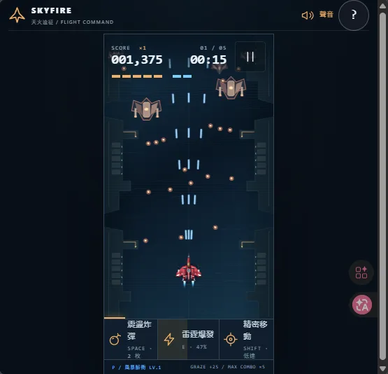

# SkyFire-MVP

縱向彈幕射擊遊戲 MVP，原生 JavaScript + Canvas 2D + Web Audio，零第三方運行依賴。

- 三種戰機、四色武器、五關戰役（至少 10 分鐘有效戰鬥）
- 手機觸控與桌面鍵鼠皆可遊玩
- 完整規格見 [SPEC.md](./SPEC.md)



## 啟動遊戲

需經 HTTP 伺服器開啟（ES Modules 不支援 `file://` 雙擊直開）。請用專案內建伺服器，才會做模組快取破壞：

```powershell
cd D:\github\chiisen\SkyFire-MVP
npm start
```

再以瀏覽器開啟 `http://localhost:4173`。此伺服器會依原始碼內容在 `import`／`src` 加上 `?v=指紋`，並送 `Cache-Control: no-store`，避免瀏覽器一直用舊的 `.js`。請不要用 `python -m http.server` 開發（它不會改寫模組 URL，容易卡快取）。port 被佔用可設環境變數 `PORT`。

## 玩法說明

- 全程自動開火，玩家專注移動走位。
- 開局選一架戰機：**金**（均衡靈活）、**銀**（高傷薄甲，雷射起步）、**銅**（重裝多炸彈）。
- 五關戰役，每關至少 120 秒；第 88 秒出首領，擊破才能前進；完整通關至少 10 分鐘。
- 擊落敵機掉四色武器：藍 P 散射、綠 L 穿透、紫 A 追蹤、金 N 爆裂；補給漂浮約 10 秒，同款拾取升級（最高 Lv.5）。
- 中央小光點才是受擊核心；貼近子彈可擦彈充能，蓄滿開 8 秒雷霆爆發（E）。
- 炸彈清彈保命（空白鍵）；標準模式致命一擊會自動炸彈，街機模式須手動。
- 關間三選一強化；戰機被擊毀最多續戰 3 次。

### 操作

| 動作     | 桌面                     | 手機                 |
| -------- | ------------------------ | -------------------- |
| 移動     | WASD / 方向鍵 / 滑鼠拖動 | 戰場任意位置按住拖動 |
| 精密低速 | Shift 或按鈕             | 「精密移動」按鈕     |
| 震盪炸彈 | 空白鍵或按鈕             | 「震盪炸彈」按鈕     |
| 雷霆爆發 | E 或按鈕（滿充能）       | 「雷霆爆發」按鈕     |
| 暫停     | P / Esc 或按鈕           | 暫停按鈕             |

## 開發指令

- 本機：`npm start`
- 測試：`npm test`

- 格式：`npx prettier --check .`

### 建置（`npm run build`）

`build.mjs` 只用 Node.js 內建模組，把運行檔鏡像到 `dist/` 並做 minify（JS/CSS 剝註解壓空白，佈局與檔名不變；模組與 `index.html` 會加上內容指紋 `?v=`；每個輸出 JS 都過 `node --check`）：

```powershell
npm run build
```

```text
dist/
├── index.html
├── icon.svg
└── src/
    ├── app.js  engine.js  data.js  render.js
    ├── airframes.js  audio.js  style.css
    └── render/
        ├── shared.js  background.js
        └── units.js  combat.js
```

- 每次執行先清空 `dist/` 再重建；`dist/` 不進版控，發佈前重跑一次即可。
- 產物是純靜態站，任何靜態託管（Vercel、GitHub Pages、Nginx）皆可發佈；僅需 Node.js，不需安裝第三方套件。

## 檔案說明

| 檔案                                  | 用途                                                                     |
| ------------------------------------- | ------------------------------------------------------------------------ |
| `index.html`                          | 遊戲入口：機庫、戰場畫布、HUD、覆蓋層、說明對話框的 DOM 結構             |
| `src/style.css`                       | 全站樣式：機庫、HUD、按鈕、手機版面                                      |
| `src/app.js`                          | 頁面進入點：建立狀態、接線、開主迴圈                                     |
| `src/app/state.js`                    | 共用狀態：DOM 查詢、本地儲存、格式化、狀態容器                           |
| `src/app/hud.js`                      | HUD 更新：分數、血量、武器、關卡資訊                                     |
| `src/app/screens.js`                  | 場景流程：選機、開局、暫停、續戰、覆蓋層、公告                           |
| `src/app/input.js`                    | 輸入接線：觸控、鍵盤、按鈕、聲音開關                                     |
| `src/app/frame.js`                    | 主迴圈步進：推進模擬、繪製、音效                                         |
| `src/engine.js`                       | 遊戲引擎：主迴圈、碰撞、敵機波次、彈幕、掉落、計時、暫停凍結             |
| `src/data.js`                         | 戰役資料入口：自 JSON 載入後再匯出戰機／武器／關卡／升級／常數           |
| `src/data/ships.json`                 | 三台可操作戰機固定資料：名稱、機碼、色票、電能色、耐久、速度、火力、炸彈 |
| `src/data/weapons.json`               | 四色武器固定資料：名稱、色票、標籤、說明、掉落後條件權重                 |
| `src/data/stages.json`                | 五關戰役固定資料：關名、首領名、色票、文案、血量、主題、提示             |
| `src/data/upgrades.json`              | 關間三選一升級卡：id、名稱、說明、標籤                                   |
| `src/data/constants.json`             | 畫布尺寸、關卡秒數、首領入場秒、補給存活秒                               |
| `src/render.js`                       | 繪製筒倉：轉出口 `drawShip`＋組幀 `drawFrame`                            |
| `src/render/shared.js`                | 繪圖圖元與共用常數：多邊形／圓／光暈／裝甲板、色票、雜湊                 |
| `src/render/background.js`            | 五關背景：海港／峽谷／工廠／軌道／晝夜調度                               |
| `src/render/units.js`                 | 作戰單位：尾焰、敵機、首領                                               |
| `src/render/combat.js`                | 戰鬥物件：雷射光束、彈丸、補給、特效                                     |
| `src/airframes.js`                    | 戰機三維網格：建模、投影、九種側傾姿態快取                               |
| `src/audio.js`                        | 合成聲音：Web Audio 即時合成音效與背景音樂步進器，無音檔                 |
| `icon.svg`                            | 瀏覽器分頁圖示                                                           |
| `build.mjs`                           | 零依賴建置：鏡像至 `dist/`、minify、模組內容指紋                         |
| `serve.mjs`                           | 本機伺服器：內容指紋 + `Cache-Control: no-store`                         |
| `cachebust.mjs`                       | 模組／HTML 指紋改寫與內容雜湊                                            |
| `tests/engine.test.mjs`               | 引擎單元測試：27 項（Node 內建 `node:test`）                             |
| `tests/render.smoke.mjs`              | 無頭渲染煙測：戰鬥＋機庫各跑一幀                                         |
| `tests/app.boot.mjs`                  | 開機煙測：DOM stub 走真實監聽器驗證開局／暫停／炸彈                      |
| `package.json`                        | 專案資訊與 `start`／`test`／`build`／`format` 指令                       |
| `SPEC.md`                             | 完整規格書（對標 Thunderfall 1:1）                                       |
| `CHANGELOG.md`                        | 變更日誌（Keep a Changelog，繁體中文）                                   |
| `AGENTS.md`、`CLAUDE.md`、`GEMINI.md` | 三份同步的 AI Agent 專案規範                                             |
| `.prettierrc`、`.prettierignore`      | Prettier 格式設定與排除路徑                                              |
| `.gitattributes`                      | 統一 LF 斷行，二進位圖檔聲明                                             |
| `dist/`                               | 建置輸出（不進版控）                                                     |
